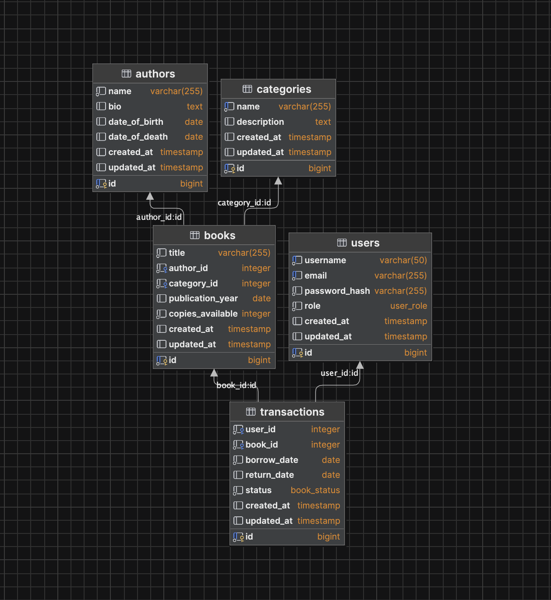

# Library REST API

## Overview
This is a RESTful API for managing a library system. The API provides functionalities for managing books, authors, categories, users, borrowing, returning books, and viewing transaction history. It supports filtering, pagination, and full-text search.

## Functional Requirements

### Book Management
- **Create Books**: Add new books to the system.
- **Retrieve Books**: Get a list of books with filters (e.g., title, author, category, availability).
- **Retrieve Book by ID**: Get details of a specific book by its ID.
- **Update Books**: Modify details of an existing book.
- **Delete Books**: Remove a book from the system.

### Author Management
- **Create Authors**: Add new authors to the system.
- **Retrieve Authors**: Get a list of authors with filters (e.g., name, books authored).
- **Retrieve Author by ID**: Get details of a specific author by their ID.
- **Update Authors**: Modify details of an existing author.
- **Delete Authors**: Remove an author from the system.

### Category Management
- **Create Categories**: Add new categories to the system.
- **Retrieve Categories**: Get a list of categories.
- **Update Categories**: Modify details of an existing category.
- **Delete Categories**: Remove a category from the system.

### User Management
- **Create Users**: Add new users to the system.
- **Retrieve Users**: Get a list of users.
- **Retrieve User by ID**: Get details of a specific user by their ID.
- **Update Users**: Modify details of an existing user.
- **Delete Users**: Remove a user from the system.

### Specialized Operations
- **Borrow Books**: Allow a user to borrow a specific book.
- **Return Books**: Allow a user to return a borrowed book.
- **View Borrowed Books**: See a list of books borrowed by a user.
- **View Transaction History**: View transaction logs for a user or book.

### Filters and Search
- **Filter Books**: Filter books by title, author, category, and availability.
- **Filter Authors**: Filter authors by name and their authored books.
- **Filter Transactions**: Filter transactions by user, book, and transaction type (e.g., borrow, return).
- **Full-Text Search**: Search for books by title, author, or category.

### Pagination
- **Pagination**: Support pagination for large datasets of books, authors, users, and transactions (e.g., `page=1&limit=20`).

### Validation
- **Validation**: Ensure non-negative values for availableCopies and totalCopies when adding or updating books.
- **Mandatory Fields**: Ensure required fields like book title and authorId are provided when creating entities.

## Non-Functional Requirements

### Compliance with REST Principles
- **Standard HTTP Methods**:  
  Use standard HTTP methods such as `GET`, `POST`, `PUT`, and `DELETE` for resource manipulation.

- **HTTP Status Codes**

### Authentication and Authorization
- **JWT Authentication**:  
  All API endpoints require a valid JWT token for authentication.

- **Role-Based Access Control**:
  - **Admin**: Full access to manage books, authors, categories, and users.
  - **User**: Limited access to view books and manage borrowed books.

### Error Handling
- Detailed error responses with appropriate HTTP status codes.
- Clear and actionable error messages to assist in debugging.

### Caching
- **Caching of frequently accessed data**:  
  Cache responses for endpoints like `/books`, `/authors`, and `/categories`.
  Invalidate cache on resource updates (via `POST`, `PUT`, `DELETE` methods).

### Scalability
- Support pagination for large datasets (e.g., books, authors, users, transactions).
- Optimize database queries and indexing to ensure efficient data retrieval.

### Data Consistency
- **Atomic Operations**:  
  Ensure consistency for actions like borrowing and returning books

### Performance
- Optimize API response times by minimizing resource-intensive operations.
- Ensure the page loads and interacts with users efficiently by using lightweight HTML, CSS, and JavaScript.

### Usability
- Provide clear and intuitive API responses with useful metadata.
- Hypermedia links to guide clients to related resources (e.g., book details, author info).


## Entities

### Book
- **Attributes**:
  - `id`: Unique identifier of the book.
  - `title`: Title of the book.
  - `authorIds`: List of author IDs.
  - `categoryIds`: List of category IDs.
  - `publicationDate`: Date of publication.
  - `availableCopies`: Number of copies available for borrowing.
  - `totalCopies`: Total number of copies in the library.

### Author
- **Attributes**:
  - `id`: Unique identifier of the author.
  - `name`: Full name of the author.
  - `biography`: Brief biography of the author.
  - `dateOfBirth`: Date of birth of the author.
  - `dateOfDeth`: Date of birth of the author.
  - `bookIds`: List of books authored by this author.

### Category
- **Attributes**:
  - `id`: Unique identifier of the category.
  - `name`: Name of the category.
  - `description`: Description of the category.

### User
- **Attributes**:
  - `id`: Unique identifier of the user.
  - `name`: Full name of the user.
  - `email`: Email address of the user.
  - `borrowedBooks`: List of books borrowed by the user (with due dates).
  - `role`: Role of the user (e.g., Admin, User).

### Transaction
- **Attributes**:
  - `id`: Unique identifier of the transaction.
  - `userId`: ID of the user who performed the transaction.
  - `bookId`: ID of the book involved in the transaction.
  - `type`: Type of transaction (e.g., Borrow, Return).
  - `borrow_date`: Date and time when the book borrowed.
  - `return_date`: Date and time when the book returned.

## Database scheme template


## **Endpoints**

### **Books**

Manage library books, including retrieving, adding, updating, borrowing, and returning books.

---
#### **GET /books**  
  Retrieve a paginated list of books.  
  **Filters**: `title`, `authorId`, `categoryId`, `availableCopies`  
  **Response Statuses**:
  - `200 OK`: Successfully retrieved the list.
  - `400 Bad Request`: Invalid filters.
  - `500 Internal Server Error`: Internal error.  
    **Caching**: ✅ Results are cached for **1 hour**.
---

#### **GET /books/{id}**  
  Retrieve a specific book by ID.  
  **Response Statuses**:
  - `200 OK`: Successfully retrieved the book.
  - `404 Not Found`: Book not found.
  - `500 Internal Server Error`: Internal error.  
    **Caching**: ✅ Cached for **24 hours**.
---

#### **POST /books**  
  Add a new book.  
  **Request Body**:
  ```json
  {
    "title": "string",
    "authorId": "integer",
    "categoryId": "integer",
    "availableCopies": "integer"
  }
  ```

 **Response Statuses**
- **201 Created**: Successfully added.
- **400 Bad Request**: Invalid input.
- **500 Internal Server Error**: Internal error.
---
#### **POST /books**
Add a new book.

**Response Statuses:**
- **201 Created**: Successfully added.
- **400 Bad Request**: Invalid input.
- **500 Internal Server Error**: Internal error.
---
#### **PUT /books/{id}**
Update an existing book.

**Request Body:**  
Same as `POST /books`.

**Response Statuses:**
- **200 OK**: Successfully updated.
- **400 Bad Request**: Invalid input.
- **404 Not Found**: Book not found.
- **500 Internal Server Error**: Internal error.
---
#### **DELETE /books/{id}**
Delete a book.

**Response Statuses:**
- **204 No Content**: Successfully deleted.
- **404 Not Found**: Book not found.
- **500 Internal Server Error**: Internal error.
---
#### **POST /books/{id}/borrow**
Borrow a book.

**Response Statuses:**
- **200 OK**: Book borrowed.
- **400 Bad Request**: Book not available.
- **404 Not Found**: Book not found.
- **500 Internal Server Error**: Internal error.
---
#### **POST /books/{id}/return**
Return a borrowed book.

**Response Statuses:**
- **200 OK**: Book returned.
- **400 Bad Request**: Not available
---
### Authors 
Manage authors in the library system.

---
#### **GET /authors**
Retrieve a paginated list of authors.

**Filters:**
- `name`
- `bookId`

**Response Statuses:**
- **200 OK**: Successfully retrieved the list.
- **400 Bad Request**: Invalid filters.
- **500 Internal Server Error**: Internal error.

**Caching:**  
✅ Results are cached for 6 hours.
---
#### **GET /authors/{id}**
Retrieve a specific author by ID.

**Response Statuses:**
- **200 OK**: Successfully retrieved the author.
- **404 Not Found**: Author not found.
- **500 Internal Server Error**: Internal error.

**Caching:**  
✅ Cached for 6 hours.
---
#### **POST /authors**
Add a new author.  

**Request Body:**
```json
{
  "name": "string",
  "bio": "string"
}
```

**Response Statuses:**  
- **201 Created**: Successfully added.  
- **400 Bad Request**: Invalid input.  
- **500 Internal Server Error**: Internal error.
---
#### **PUT /authors/{id}**
Update an author.  

**Request Body:**  
Same as `POST /authors`.

**Response Statuses:**  
- **200 OK**: Successfully updated.  
- **400 Bad Request**: Invalid input.  
- **404 Not Found**: Author not found.  
- **500 Internal Server Error**: Internal error.  
---
#### **DELETE /authors/{id}**
Delete an author.  

**Response Statuses:**  
- **204 No Content**: Successfully deleted.  
- **404 Not Found**: Author not found.  
- **500 Internal Server Error**: Internal error.  
---
### Categories
Manage categories of books in the library.

---
#### **GET /categories**
Retrieve a list of categories.

**Response Statuses:**
- **200 OK**: Successfully retrieved.
- **500 Internal Server Error**: Internal error.

**Caching:**  
✅ Cached for 24 hours.
---
#### **GET /categories/{id}**
Retrieve a specific category by ID.

**Response Statuses:**
- **200 OK**: Successfully retrieved.
- **404 Not Found**: Category not found.
- **500 Internal Server Error**: Internal error.
---
#### **POST /categories**
Add a new category.

**Request Body:**
```json
{
  "name": "string"
}
```
**Response Statuses:**
- **201 Created**: Successfully added.
- **400 Bad Request**: Invalid input.
- **500 Internal Server Error**: Internal error.  
---
#### **PUT /categories/{id}**
Update a category.

**Request Body:**  
Same as `POST /categories`.

**Response Statuses:**
- **200 OK**: Successfully updated.
- **400 Bad Request**: Invalid input.
- **404 Not Found**: Category not found.
- **500 Internal Server Error**: Internal error.
---
#### **DELETE /categories/{id}**
Delete a category.

**Response Statuses:**
- **204 No Content**: Successfully deleted.
- **404 Not Found**: Category not found.
- **500 Internal Server Error**: Internal error.  
---
### Transactions 
Manage borrowing and returning of books.

---
#### **GET /transactions**
Retrieve a paginated list of transactions.  
**Filters:** `userId`, `bookId`, `type`.

**Response Statuses:**
- **200 OK**: Successfully retrieved the list.
- **400 Bad Request**: Invalid filters.
- **500 Internal Server Error**: Internal error.
---
#### **GET /transactions/{id}**
Retrieve a specific transaction by ID.

**Response Statuses:**
- **200 OK**: Successfully retrieved the transaction.
- **404 Not Found**: Transaction not found.
- **500 Internal Server Error**: Internal error.
---
#### Authentication

**Method:** Bearer Token (JWT)

Add a valid token in the Authorization header:

```http
Authorization: Bearer <token_here>
```
---
